# SADHACKING_TOOLKING_POLICE_RA1237
Para las siguientes herramientas, hemos investigado para que sirven y cuales son sus ventajas,
posteriormente lo hemos instalado y lo hemos probado.

## 1.What is my ip (JUANDI)

Es un sitio web, que sirve para identificar cual es tu ip publica, a partir de tu ip privada, esta ofrece detalles como quién es tu proveedor de internet, y la ciudad desde donde te lo provee

## 2.IPQualityScore (Sancha)

Es una herramienta web que te permite saber si la dirección ip que le interesa al usuario es segura, además muestra la ubicación física del servidor.

Por ejemplo, haciendo un nslookup de la web elmundo.es, nos refleja una ip.

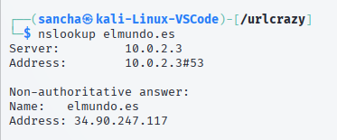

Esta es la web, lo que sale tapado es la dirección física del equipo que la consulta, por eso sale tapado

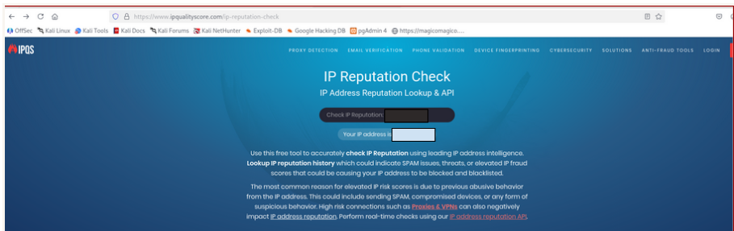

Con la ip resultante de la consulta de la web, nos sale lo siguiente:

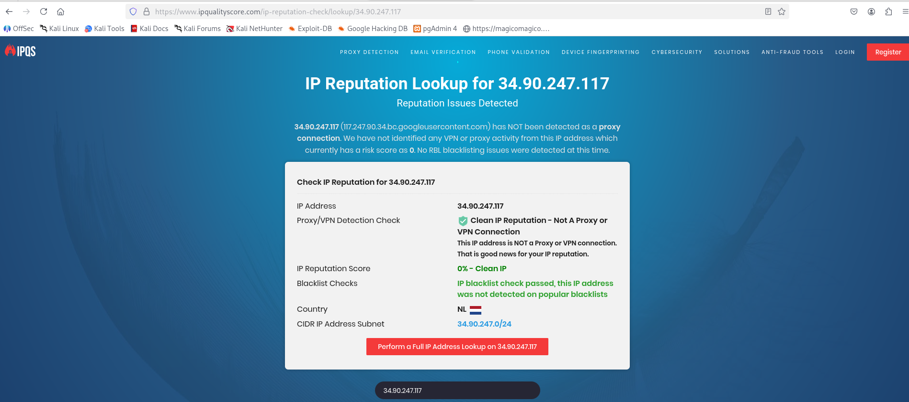

Nos indica que el servidor se encuentra en Holanda, la ip no sale en ningua lista sospechosa e indica a la subred a la que pertenece.
## 3. JoeSandox (Gerardo)

Es una plataforma avanzada de análisis de malware. Se usa principalmente en ciberseguridad para analizar archivos sospechosos, URLs y comportamientos maliciosos donde el archivo sospechoso se ejecuta en un entorno virtual aislado y seguro. Funciona de la siguiente manera:
- Análisis dinámico: Registra a qué ip, dominios, países… quiero conectarse, monitorea que procesos inician y averigua si el malware trata de crear, modificar o borrar archivos.
- Análisis estático: Antes de ejecutar el archivo visualiza información del archivo (como su hash, tamaño, encabezado…), busca patrones de texto para revelar dominios maldiciones, comandos… y detecta técnicas que tratan de ocultar archivos maliciosos.
- Genera informes a través de puntuación de riesgo, proporciona la lista de direcciones IP, hashes, dominios y claves de registro que el malware tocó y puede llegar a mostrar una grabación de lo que ocurrió durante la ejecución en el entorno virtual.

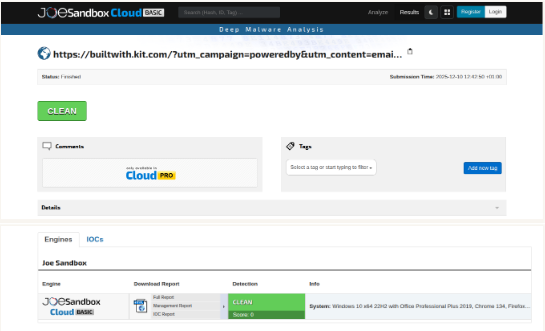

## 4.Hybrid Analysis (Gerardo)
Es un servicio online que permite subir archivos o URLs sospechosas y analizarlas en un sandbox: un entorno seguro donde se ejecutan para observar su comportamiento. Su objetivo es detectar malware, virus, troyanos, ransomware, scripts maliciosos, etc… Funciona:
- Análisis Estático: Compara el hash del archivo con una vasta base de datos de amenazas conocidas, examina las cadenas de texto incrustadas para buscar posibles comandos, URLs, claves de registro o nombres de archivos sospechosos y analiza la estructura del ejecutable para identificar si está empaquetado u ofuscado.
- Análisis Dinámico: Registra las interacciones del archivo con el sistema operativo, captura todo el tráfico de red generado, cuando el malware utiliza técnicas de inyección o desempaquetamiento , Hybrid Analysis intenta obtener la versión no empaquetada del código malicioso, facilitando el análisis.
- Puntúa el archivo, genera una lista de todos los artefactos maliciosos que el archivo intentó usar (hashes, dominios contactados, direcciones IP y rutas de archivo.) y mapea las acciones del malware con el framework MITRE ATT&CK (para entender mejor cómo fue el ataque).

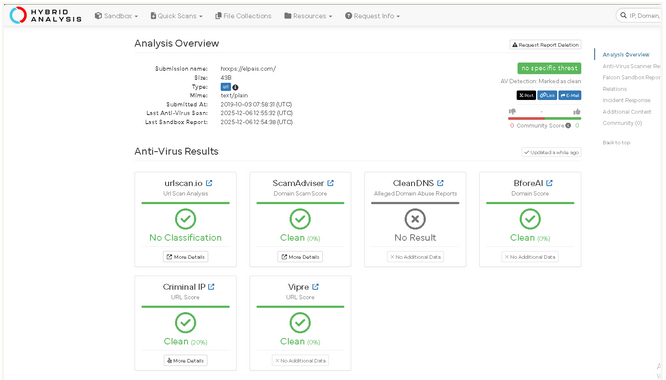

## 5.Urlcrazy (Sancha)

 Sirve para generar y probar errores tipográficos o variaciones de dominio para detectar o realizar errores tipográficos, secuestro de URL, phishing y espionaje corporativo. La idea es bastante sencilla: URLCrazy toma un nombre de dominio como una semilla, genera una lista de dominios potenciales de phishing y luego comprueba si están registrados.

Para empezar la instalación, empezamos con "Supo apt-get install urlcrazy"

Asi se ve cuando lo inicias:

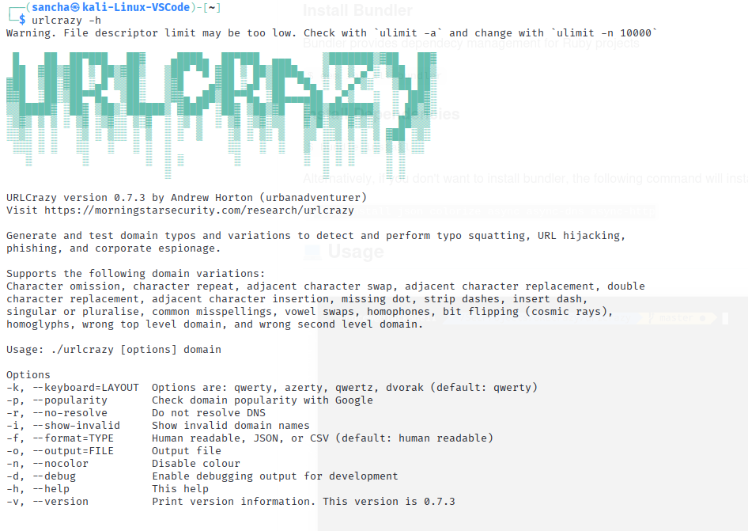

Posteriormente, se instala este paquete

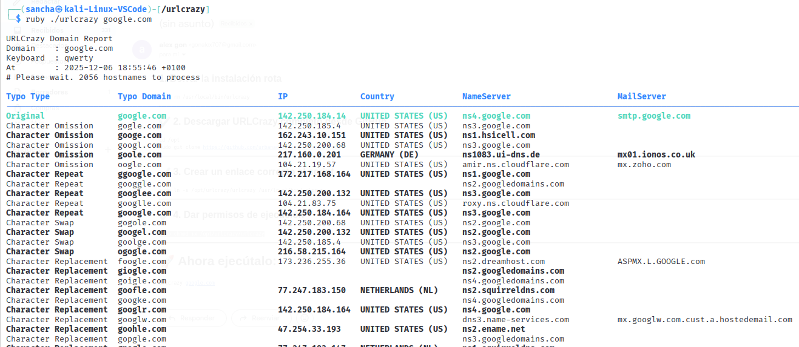

Además, se clona el git donde se encuentra los paquetes adicionales y los otros scripts

 

Y por último se instala el Bundle

Para probarlo, con un ejemplo google.com

Las direcciones veraces son aquellas que empiezan con 142.50, el resto son sospechosas, como gogle.com

## 6.VoilaNorbert ((JUANDI))

Es una herramienta para encontrar y verificar los correos electrónicos, sobre todo correos corporativos a partir de nombres y dominios, con ello se puede comprobar la validez del correo buscado, además también ayuda a enriquecer, es decir,  Obtiene datos extra para perfiles de prospectos, como cargo, ubicación o perfiles de redes sociales.

Ésta es una búsqueda del correo del director de netflix españa, además, para buscar hay que registrarse.
## 7.SocialPwned (Gerardo)

SocialPwned es una herramienta de código abierto diseñada para realizar OSINT y comprobar si las cuentas de correo electrónico o nombres de usuario de una persona han sido expuestos en filtraciones de datos o data breaches. El objetivo de esta herramienta es determinar si un objetivo tiene credenciales comprometidas que podrían ser utilizadas en un ataque de relleno de credenciales.

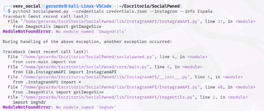
Debería verse algo así:

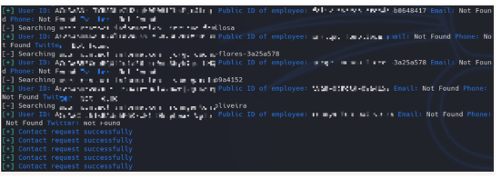

## 8.DuckDuckGo:((JUANDI))

Duckduckgo actúa como un buscador, pero en la versión para móviles es un navegador web, que ofrece una búsqueda privada por la red, no guarda ninguna información personal y bloquea los rastreadores de los sitios web, además es una extensión muy liviana para los ordenadores y se puede instalar en cualquier navegador. Además es un buscador que no guarda información del usuario, esto implica que no personaliza sus búsquedas, otro punto que tiene es que no guarda la dirección IP del usuario ni guarda información relacionada con ellos, además, tampoco comparte los datos sobre las búsquedas de los usuarios con las páginas web. por ello es un buscador bastante seguro. como prueba hago una busqueda en el navegador brave, pero con el buscador predeterminado duckduckgo

## 9.VisualPing:(Sancha)

Es una herramienta web, en la cual que se debe de ingresar la URL de la página o blog que se quiere monitorear y la web se encarga automáticamente  de hacer una captura de la página. Una vez hecho eso se tienen dos opciones, una que verifique la página completa o con el cursor se selecciona una área de la página. Luego te permite ajustar cada cuanto tiempo te notificar cualquier tipo de cambio para que te llegue la  que provocará el envío de la notificación y su dirección de email. Para poder usar este servicio hay que registrarse de forma gratuita, no obstante con la versión gratuita te avisa como poco cada hora y si quieres que te avise con un intervalo menor hay que subscribirse a una oferta de pago.

Cada vez que Visual Ping verifica la página o área de la página que seleccionaron, si encuentra un cambio, enviará un email con el screenshot inicial y un screenshot actual con los cambios.

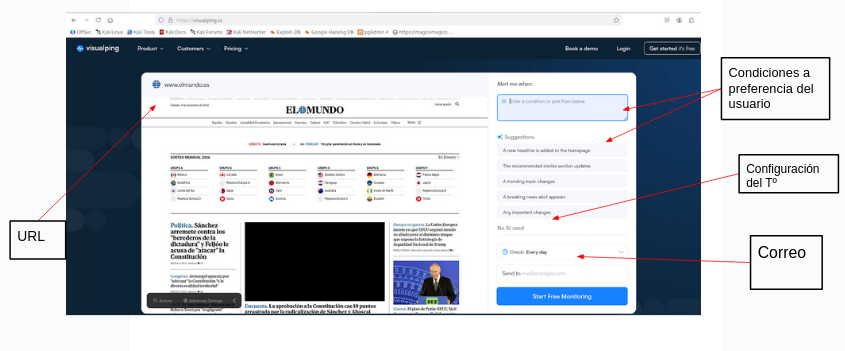

Al tratarse una aplicacion web no hace falta descargarse nada, no obstante hay que registrarse, para que se envíe la notificación al correo. Además, tiene IA integrada por lo que las condiciones ofrecidas de sugerencia, se van cambiando.

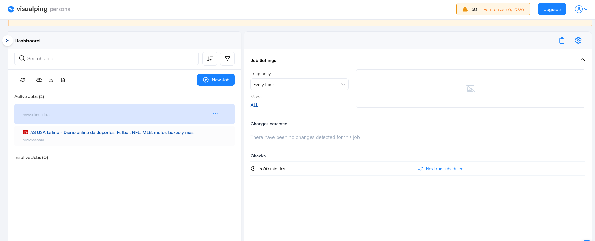

Hasta que se vuelva a actualizar dentro de una hora (al tener el plan gratuito no podemos bajar el tiempo), hay que esperar.

Para hacer una prueba se ha tomado la web del as.com puesto que se va actualizando con los partidos de fútbol que se desarrollan
a lo largo del día, la primera foto muestra la que se ha establecido como originial

La segunda muestra los cambios que se han producido.

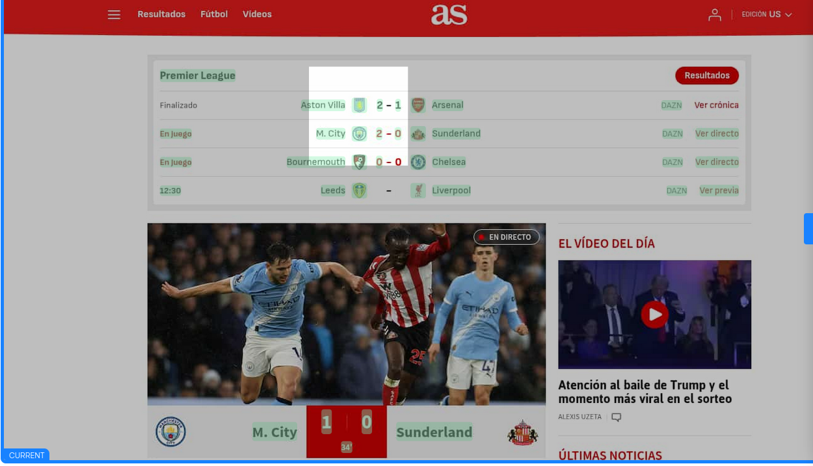

Aquí se muestra con subrayado en rosa, los cambios que se han ido produciendo.

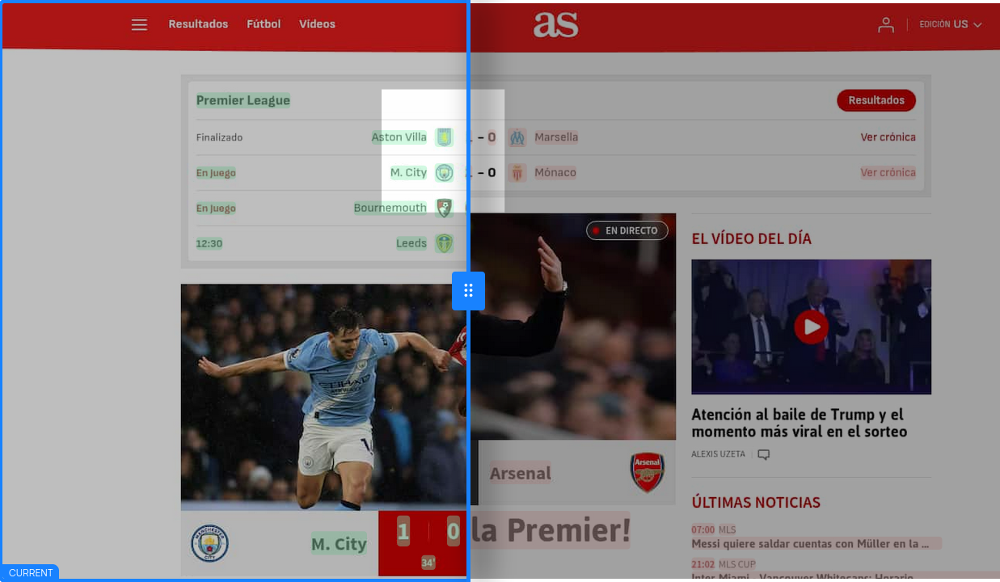

Esta es la notificación del correo que le llega al usuario:

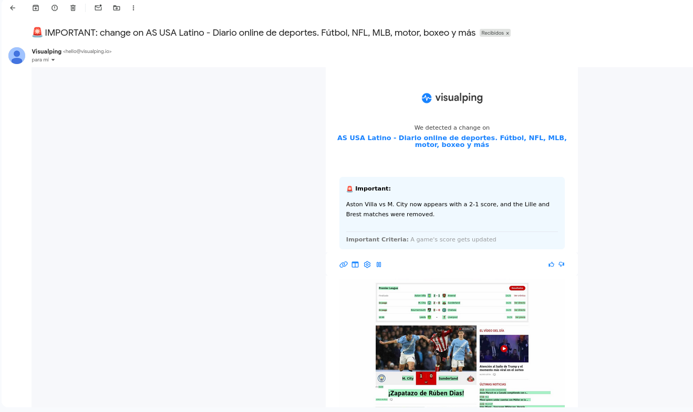

## 10. Browserling

Permite ver y probar cómo se comporta un sitio web en diferentes navegadores y sistemas operativos sin tener que instalarlos todos en tu propia máquina. Permite visitar sitios web sospechosos o maliciosos sin poner en riesgo tu propia computadora, ya que la navegación ocurre dentro de una máquina virtual remota y desechable.

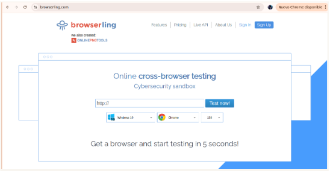

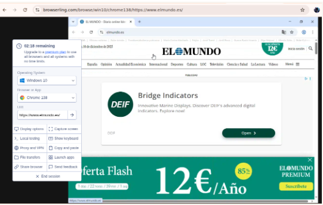

## Bibliografía

- https://webcatalog.io/es/apps/visualping-io (Visualping)
- https://keepcoding.io/blog/que-es-urlcrazy-ciberseguridad/ (urlcrazy)
- https://hybrid-analysis.com/release-notes (hybrid analysis)
- https://www.joesecurity.org/joe-reverser (Joe Sandox)
- https://mrtuxx.github.io/tools/SocialPwned-ES/  (Social Pwned)
- https://www.ipqualityscore.com/ip-reputation-check (IPQUALITYSCORE)
- https://www.incibe.es/ciudadania/herramientas/duckduckgo (DuckDuckGo)
- https://www.xataka.com/basics/duckduckgo-que-principales-diferencias-google (DuckDuckGo)
- https://www.voilanorbert.com/ (VoilaNorbert)
- https://whatismyipaddress.com/ (What is my i paddress)
- https://www.joesecurity.org/joe-reverser (SandBox)
- https://www.browserling.com (browserling) 

